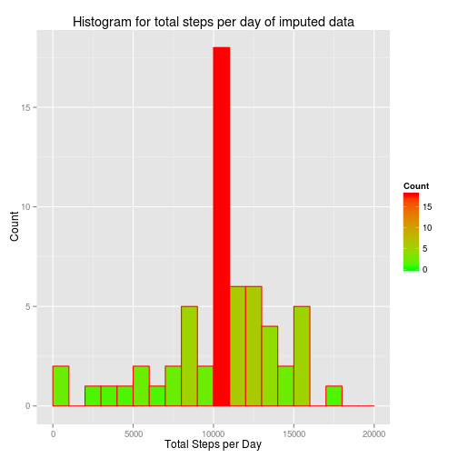

Reproducible Research Peer Assessment 1
==========================================


#Introduction
This assignment is to analyse a large amount of data collected about personal movement using activity monitoring. It analyses the steps recorded in every 5 minute intervals of a person's avtivity monitored in his activity device throughout the day. 

The data consists of two months of data from an anonymous individual collected during the months of October and November, 2012 and include the number of steps taken in 5 minute intervals each day.

##Data
The data is stored in the following forked repository in github [forked repository in Github!](https://github.com/rdpeng/RepData_PeerAssessment1).

The variables included in this dataset are:


    steps: Number of steps taking in a 5-minute interval (missing values are coded as NA)
    
    date: The date on which the measurement was taken in YYYY-MM-DD format
    
    interval: Identifier for the 5-minute interval in which measurement was taken
## Include file for the following procedure    

```r
library(plyr)
library(dplyr)
library(ggplot2)
options(scipen = 999)
```
    
## Loading and preprocessing the data


```r
data<- read.csv("activity.csv", sep =",", header =TRUE)

complete_data<- data[complete.cases(data),]
```
## Find mean total number of steps taken per day

Total number of steps taken per day: 

```r
stepsperday<- data %>% 
        select(steps,date)%>%
        group_by(date) %>%
        summarize(totalsteps=sum(steps))
```
####1. Histogram of the total number of steps taken each day

```r
ggplot(stepsperday, aes(x = totalsteps)) + 
        geom_histogram(breaks=seq(0,20000, by =1000), aes(fill = ..count..), col = "red") +
        scale_fill_gradient("Count", low = "green", high = "red")+
        ggtitle("Histogram for total steps per day")+
        xlab("Total Steps per Day")+
        ylab("Count")
```

 

####2. The mean and median of total number of steps taken per day


```r
mean_per_day<- mean(stepsperday$totalsteps, na.rm =TRUE)
```

**The mean per day is 10766.1886792.**


```r
#Median per day
median_per_day<- median(stepsperday$totalsteps, na.rm =TRUE)
```

**The median per day is 10765.**

## Find the average daily activity pattern

5-minute interval average:


```r
meanperinterval<- data %>% 
        select(steps, interval)%>%
        group_by(interval) %>%
        summarize(mean_steps = mean(steps,na.rm=TRUE))
```
####1. Time series plot (i.e. type = "l") of the 5-minute interval (x-axis) and the average number of steps taken, averaged across all days (y-axis)

```r
ggplot(meanperinterval, aes(x = interval, y = mean_steps)) + 
geom_point(size =2, col ="blue")  +
geom_line( size =2, col ="blue")  +
theme(axis.text.x = element_text(angle = 90, hjust = 1)) +
ggtitle("Average Daily Activity Pattern") +
ylab("Average Steps") +
xlab("Intervals")
```

 

####2. Which 5-minute interval, on average across all the days in the dataset, contains the maximum number of steps?

```r
maxi<-which( meanperinterval$mean_steps == max(meanperinterval$mean_steps))
max_5_minute_interval <-meanperinterval$interval[maxi]
```
 **The maximum 5-minute interval which contains the maximum number of steps is 835.**
 
## Imputing missing values


####1. Total number of missing values in the dataset (i.e. the total number of rows with NAs)


```r
noofmissingvalues<- length(which(is.na(data) ==TRUE))
```

**Total number of missing values in the dataset is 2304.**

####2.Devise a strategy for filling in all of the missing values in the dataset.

**The missing values are filled with the mean for that 5-minute interval of each missing value. Following in the procedure followed to the achieve the result. **

* A new data frame 'dataNA' with all the rows containg missing values

```r
dataNA<-data[is.na(data$steps)==T, ]
#dataNA$steps[is.na(dataNA$steps)]<- mean(data$steps,na.rm =TRUE)
head(dataNA)
```

```
##   steps       date interval
## 1    NA 2012-10-01        0
## 2    NA 2012-10-01        5
## 3    NA 2012-10-01       10
## 4    NA 2012-10-01       15
## 5    NA 2012-10-01       20
## 6    NA 2012-10-01       25
```

```r
dataimpute_by_interval<-merge(dataNA,meanperinterval,by.x = "interval",by.y="interval")
dataimpute_by_interval$steps <- NULL
dataimpute_by_interval<- arrange(dataimpute_by_interval,date,interval)
nrow(dataimpute_by_interval)
```

```
## [1] 2304
```

```r
dataimpute_by_interval<- plyr::rename(dataimpute_by_interval,c("mean_steps"="steps"))
head(dataimpute_by_interval)
```

```
##   interval       date     steps
## 1        0 2012-10-01 1.7169811
## 2        5 2012-10-01 0.3396226
## 3       10 2012-10-01 0.1320755
## 4       15 2012-10-01 0.1509434
## 5       20 2012-10-01 0.0754717
## 6       25 2012-10-01 2.0943396
```
####3.New dataset that is equal to the original dataset but with the missing data filled in.

```r
dataimpute<- rbind(data,dataimpute_by_interval)
dataimpute<- arrange(dataimpute,date,interval)
dataimpute<- dataimpute[complete.cases(dataimpute),]
head(dataimpute)
```

```
##        steps       date interval
## 2  1.7169811 2012-10-01        0
## 4  0.3396226 2012-10-01        5
## 6  0.1320755 2012-10-01       10
## 8  0.1509434 2012-10-01       15
## 10 0.0754717 2012-10-01       20
## 12 2.0943396 2012-10-01       25
```

```r
nrow(data)
```

```
## [1] 17568
```
####4. Histogram of the total number of steps taken each day the mean and median total number of steps taken per day. Do these values differ from the estimates from the first part of the assignment? What is the impact of imputing missing data on the estimates of the total daily number of steps?


```r
impute_stepsperday<- dataimpute %>% 
        select(steps,date)%>%
        group_by(date) %>%
        summarize(totalsteps=sum(steps))

ggplot(impute_stepsperday, aes(x = totalsteps)) + 
        geom_histogram(breaks=seq(0,20000, by =1000), aes(fill = ..count..), col = "red") +
        scale_fill_gradient("Count", low = "green", high = "red")+
        ggtitle("Histogram for total steps per day of imputed data")+
        xlab("Total Steps per Day")+
        ylab("Count")
```

 


```r
mean_per_day<- mean(impute_stepsperday$totalsteps, na.rm =TRUE)
```
**Mean of total number of steps per day is 10766.1886792.**


```r
#Median per day
median_per_day<- median(impute_stepsperday$totalsteps, na.rm =TRUE)
```
**Median of total number of steps per day is 10766.1886792.**

**The impact of imputing missing data on the estimates of the total daily number of steps is low.**

## Finding the differences in activity patterns between weekdays and weekends

####1. Create a new factor variable in the dataset with two levels -- "weekday" and "weekend" indicating whether a given date is a weekday or weekend day.

```r
dataimpute$day <- c("Weekday", "Weekend")
dataimpute$day[which(chron::is.weekend(dataimpute$date))]<-"Weekend"
dataimpute$day[which(!chron::is.weekend(dataimpute$date))]<-"Weekday"
head(dataimpute)
```

```
##        steps       date interval     day
## 2  1.7169811 2012-10-01        0 Weekday
## 4  0.3396226 2012-10-01        5 Weekday
## 6  0.1320755 2012-10-01       10 Weekday
## 8  0.1509434 2012-10-01       15 Weekday
## 10 0.0754717 2012-10-01       20 Weekday
## 12 2.0943396 2012-10-01       25 Weekday
```
####2. Make a panel plot containing a time series plot (i.e. type = "l") of the 5-minute interval (x-axis) and the average number of steps taken, averaged across all weekday days or weekend days (y-axis). The plot should look something like the following, which was created using simulated data:

```r
imputemeanperinterval<- dataimpute %>% 
        select(steps, interval,day)%>%
        group_by(interval,day) %>%
        summarize(steps = mean(steps,na.rm=TRUE))
#%>%        dplyr::arrange(day,interval)

ggplot(imputemeanperinterval, aes(x=interval, y=steps, group=1)) + 
        geom_line(col ="blue") +
        facet_wrap(~ day, ncol=1)+
        ggtitle("Average Steps by 5-Minute Interval: Weekdays vs Weekends")
```

 

**The plots shows that there are more activites on weekends than weekdays.**

